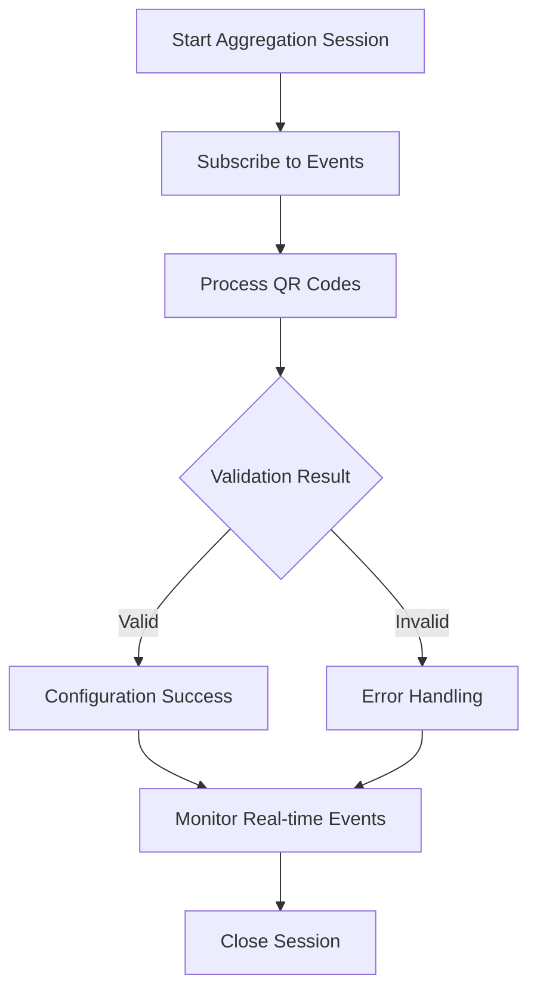

# Package Aggregation Testing Guide

This document provides comprehensive test cases and examples for testing the Package Aggregation functionality with different scenarios and use cases.

## Prerequisites

1. Ensure MongoDB is running with replica set (required for Change Streams)
2. Start the NestJS application
3. Access GraphQL Playground at `http://localhost:3000/graphql`

## Test Flow Overview



## Test Case 1: Successful Package Aggregation Flow

### Step 1: Start Package Aggregation Session

```graphql
mutation StartPackageAggregation {
  startPackageAggregation(input: {
    name: "Batch Production A001"
    description: "Processing packages for morning shift"
    sessionMode: PACKAGE_AGGREGATION
    userId: "operator_001"
  }) {
    _id
    name
    status
    sessionMode
    processedQrCodes
    createdAt
  }
}
```

**Expected Response:**
```json
{
  "data": {
    "startPackageAggregation": {
      "_id": "67123456789012345678901a",
      "name": "Batch Production A001",
      "status": "OPEN",
      "sessionMode": "PACKAGE_AGGREGATION",
      "processedQrCodes": [],
      "createdAt": "2024-10-14T10:30:00.000Z"
    }
  }
}
```

### Step 2: Subscribe to Real-time Events

```graphql
subscription PackageAggregationEvents($channelId: ID!) {
  packageAggregationEvents(channelId: $channelId) {
    channelId
    messageId
    eventType
    data
    error
  }
}
```

**Variables:**
```json
{
  "channelId": "67123456789012345678901a"
}
```

### Step 3: Process Valid QR Code Pair

```graphql
mutation ProcessAggregationMessage {
  processAggregationMessage(input: {
    channelId: "67123456789012345678901a"
    targetQr: "PKG_COMP_001"
    outerQrCode: "OUT_QR_001"
    author: "operator_001"
    eventType: "PACKAGE_CONFIGURATION"
    metadata: "{\"batchId\": \"A001\", \"lineNumber\": 1}"
  }) {
    _id
    content
    status
    aggregationData {
      targetQr
      outerQrCode
      eventType
      metadata
    }
    errorMessage
    createdAt
  }
}
```

**Expected Response:**
```json
{
  "data": {
    "processAggregationMessage": {
      "_id": "67123456789012345678901b",
      "content": "Package aggregation: PKG_COMP_001 -> OUT_QR_001",
      "status": "VALID",
      "aggregationData": {
        "targetQr": "PKG_COMP_001",
        "outerQrCode": "OUT_QR_001",
        "eventType": "PACKAGE_CONFIGURATION",
        "metadata": "{\"batchId\": \"A001\", \"lineNumber\": 1}"
      },
      "errorMessage": null,
      "createdAt": "2024-10-14T10:31:00.000Z"
    }
  }
}
```

**Expected Subscription Event:**
```json
{
  "data": {
    "packageAggregationEvents": {
      "channelId": "67123456789012345678901a",
      "messageId": "67123456789012345678901b",
      "eventType": "CONFIGURATION_COMPLETED",
      "data": "{\"targetQr\":\"PKG_COMP_001\",\"outerQr\":\"OUT_QR_001\",\"product\":\"product123\"}",
      "error": null
    }
  }
}
```

### Step 4: Close Session

```graphql
mutation UpdateChannelStatus {
  updateChannelStatus(input: {
    channelId: "67123456789012345678901a"
    status: "CLOSED"
  }) {
    _id
    status
    processedQrCodes
    updatedAt
  }
}
```

---

## Test Case 2: Error Handling - Already Configured QR

### Process Already Configured QR Code

```graphql
mutation ProcessAlreadyConfigured {
  processAggregationMessage(input: {
    channelId: "67123456789012345678901a"
    targetQr: "PKG_COMP_002_CONFIGURED"
    author: "operator_001"
    eventType: "PACKAGE_CONFIGURATION"
  }) {
    _id
    status
    errorMessage
    aggregationData {
      targetQr
    }
  }
}
```

**Expected Response:**
```json
{
  "data": {
    "processAggregationMessage": {
      "_id": "67123456789012345678901c",
      "status": "ALREADY_CONFIGURED",
      "errorMessage": "QR code 'PKG_COMP_002_CONFIGURED' is already configured",
      "aggregationData": {
        "targetQr": "PKG_COMP_002_CONFIGURED"
      }
    }
  }
}
```

**Expected Subscription Event:**
```json
{
  "data": {
    "packageAggregationEvents": {
      "channelId": "67123456789012345678901a",
      "messageId": "67123456789012345678901c",
      "eventType": "ERROR",
      "data": null,
      "error": "QR code 'PKG_COMP_002_CONFIGURED' is already configured"
    }
  }
}
```

---

## Test Case 3: Error Handling - QR Code Not Found

### Process Non-existent QR Code

```graphql
mutation ProcessNotFound {
  processAggregationMessage(input: {
    channelId: "67123456789012345678901a"
    targetQr: "NONEXISTENT_QR_999"
    author: "operator_001"
  }) {
    _id
    status
    errorMessage
  }
}
```

**Expected Response:**
```json
{
  "data": {
    "processAggregationMessage": {
      "_id": "67123456789012345678901d",
      "status": "NOT_FOUND",
      "errorMessage": "COMPOSED QR code 'NONEXISTENT_QR_999' not found"
    }
  }
}
```

---

## Test Case 4: Error Handling - Duplicate in Session

### Process Same QR Code Twice

```graphql
# First processing (should succeed)
mutation ProcessFirst {
  processAggregationMessage(input: {
    channelId: "67123456789012345678901a"
    targetQr: "PKG_COMP_003"
    outerQrCode: "OUT_QR_003"
    author: "operator_001"
  }) {
    _id
    status
  }
}

# Second processing of same QR (should fail)
mutation ProcessDuplicate {
  processAggregationMessage(input: {
    channelId: "67123456789012345678901a"
    targetQr: "PKG_COMP_003"
    outerQrCode: "OUT_QR_004"
    author: "operator_001"
  }) {
    _id
    status
    errorMessage
  }
}
```

**Expected Response for Duplicate:**
```json
{
  "data": {
    "processAggregationMessage": {
      "_id": "67123456789012345678901e",
      "status": "DUPLICATE_IN_SESSION",
      "errorMessage": "QR code 'PKG_COMP_003' has already been processed in this session"
    }
  }
}
```

---

## Test Case 5: Error Handling - OUTER QR Not Configured

### Process with Unconfigured OUTER QR

```graphql
mutation ProcessUnconfiguredOuter {
  processAggregationMessage(input: {
    channelId: "67123456789012345678901a"
    targetQr: "PKG_COMP_004"
    outerQrCode: "OUT_QR_UNCONFIGURED"
    author: "operator_001"
  }) {
    _id
    status
    errorMessage
  }
}
```

**Expected Response:**
```json
{
  "data": {
    "processAggregationMessage": {
      "_id": "67123456789012345678901f",
      "status": "NOT_CONFIGURED",
      "errorMessage": "OUTER QR code 'OUT_QR_UNCONFIGURED' is not configured"
    }
  }
}
```

---

## Test Case 6: Session Management Flow

### Pause and Resume Session

```graphql
# Pause session
mutation PauseSession {
  updateChannelStatus(input: {
    channelId: "67123456789012345678901a"
    status: "PAUSED"
  }) {
    _id
    status
    updatedAt
  }
}

# Try to process while paused (should fail)
mutation ProcessWhilePaused {
  processAggregationMessage(input: {
    channelId: "67123456789012345678901a"
    targetQr: "PKG_COMP_005"
    author: "operator_001"
  }) {
    _id
    status
    errorMessage
  }
}

# Resume session (change back to OPEN)
mutation ResumeSession {
  updateChannelStatus(input: {
    channelId: "67123456789012345678901a"
    status: "OPEN"
  }) {
    _id
    status
  }
}
```

---

## Test Case 7: Bulk Processing Workflow

### Process Multiple QR Codes in Sequence

```graphql
# Process multiple QR codes rapidly to test real-time performance
mutation ProcessBulk1 {
  processAggregationMessage(input: {
    channelId: "67123456789012345678901a"
    targetQr: "PKG_BULK_001"
    outerQrCode: "OUT_BULK_001"
    author: "operator_001"
    metadata: "{\"batch\": \"BULK_TEST\", \"sequence\": 1}"
  }) {
    _id
    status
    aggregationData { targetQr }
  }
}

mutation ProcessBulk2 {
  processAggregationMessage(input: {
    channelId: "67123456789012345678901a"
    targetQr: "PKG_BULK_002"
    outerQrCode: "OUT_BULK_002"
    author: "operator_001"
    metadata: "{\"batch\": \"BULK_TEST\", \"sequence\": 2}"
  }) {
    _id
    status
    aggregationData { targetQr }
  }
}

mutation ProcessBulk3 {
  processAggregationMessage(input: {
    channelId: "67123456789012345678901a"
    targetQr: "PKG_BULK_003"
    outerQrCode: "OUT_BULK_003"
    author: "operator_001"
    metadata: "{\"batch\": \"BULK_TEST\", \"sequence\": 3}"
  }) {
    _id
    status
    aggregationData { targetQr }
  }
}
```

### Query Session Progress

```graphql
query CheckSessionProgress($channelId: ID!) {
  channel(id: $channelId) {
    _id
    name
    status
    processedQrCodes
    messages {
      _id
      status
      aggregationData {
        targetQr
        outerQrCode
      }
      errorMessage
      createdAt
    }
  }
}
```

---

## Test Case 8: Real-time Event Filtering

### Subscribe to Specific Event Types

```graphql
# Subscribe only to validation events
subscription ValidationOnly($channelId: ID!) {
  validationEvents(channelId: $channelId) {
    channelId
    messageId
    eventType
    data
    error
  }
}

# Subscribe only to configuration events
subscription ConfigurationOnly($channelId: ID!) {
  configurationEvents(channelId: $channelId) {
    channelId
    messageId
    eventType
    data
    error
  }
}

# Subscribe only to error events
subscription ErrorsOnly($channelId: ID!) {
  aggregationErrorEvents(channelId: $channelId) {
    channelId
    messageId
    eventType
    error
  }
}
```

---

## Test Case 9: Multi-User Session

### Test Concurrent Processing

```graphql
# User 1 starts processing
mutation User1Process {
  processAggregationMessage(input: {
    channelId: "67123456789012345678901a"
    targetQr: "PKG_USER1_001"
    outerQrCode: "OUT_USER1_001"
    author: "operator_001"
  }) {
    _id
    status
    author
  }
}

# User 2 processes simultaneously
mutation User2Process {
  processAggregationMessage(input: {
    channelId: "67123456789012345678901a"
    targetQr: "PKG_USER2_001"
    outerQrCode: "OUT_USER2_001"
    author: "operator_002"
  }) {
    _id
    status
    author
  }
}
```

---

## Test Case 10: Finalize Session

### Complete and Finalize Aggregation Session

```graphql
# Finalize session (permanent closure)
mutation FinalizeSession {
  updateChannelStatus(input: {
    channelId: "67123456789012345678901a"
    status: "FINALIZED"
  }) {
    _id
    status
    processedQrCodes
    updatedAt
  }
}

# Try to process after finalization (should fail)
mutation ProcessAfterFinalized {
  processAggregationMessage(input: {
    channelId: "67123456789012345678901a"
    targetQr: "PKG_AFTER_FINAL"
    author: "operator_001"
  }) {
    _id
    status
    errorMessage
  }
}
```

**Expected Error:**
```json
{
  "errors": [
    {
      "message": "Channel is finalized and cannot accept new messages"
    }
  ]
}
```

---

## Performance Testing

### Load Testing Script

```javascript
// Use with a GraphQL client library
const testCases = [
  { targetQr: "LOAD_TEST_001", outerQr: "OUT_LOAD_001" },
  { targetQr: "LOAD_TEST_002", outerQr: "OUT_LOAD_002" },
  { targetQr: "LOAD_TEST_003", outerQr: "OUT_LOAD_003" },
  // ... up to 100+ test cases
];

async function runLoadTest(channelId) {
  const promises = testCases.map((testCase, index) => {
    return processAggregationMessage({
      channelId,
      targetQr: testCase.targetQr,
      outerQrCode: testCase.outerQr,
      author: `load_tester_${index % 5}`, // 5 concurrent users
      metadata: JSON.stringify({ loadTest: true, index })
    });
  });
  
  const results = await Promise.all(promises);
  console.log('Load test completed:', results.length, 'processed');
}
```

---

## Monitoring & Debugging Queries

### Check System Health

```graphql
query SystemHealth {
  channels {
    _id
    name
    status
    sessionMode
    processedQrCodes
    messages {
      _id
      status
      errorMessage
    }
  }
}

query ErrorSummary($channelId: ID!) {
  channelMessages(channelId: $channelId) {
    _id
    status
    errorMessage
    aggregationData {
      targetQr
    }
    createdAt
  }
}
```

### Real-time Performance Monitoring

```graphql
subscription AllChannelEvents {
  channelCreated {
    _id
    name
    status
    createdAt
  }
}

subscription AllMessageEvents {
  messageCreated {
    _id
    status
    channelId
    createdAt
  }
}
```

---

## Expected Results Summary

| Test Case | Expected Status | Key Validation |
|-----------|----------------|----------------|
| Successful Flow | `VALID` | QR configured, relationships updated |
| Already Configured | `ALREADY_CONFIGURED` | Error message returned |
| Not Found | `NOT_FOUND` | QR existence check |
| Duplicate in Session | `DUPLICATE_IN_SESSION` | Session tracking works |
| Unconfigured OUTER | `NOT_CONFIGURED` | OUTER QR validation |
| Paused Session | Error | Status check prevents processing |
| Bulk Processing | Multiple `VALID` | Performance and real-time events |
| Multi-user | `VALID` for both | Concurrent processing support |
| Finalized Session | Error | Permanent closure enforced |

## Tips for Testing

1. **Use GraphQL Playground** for interactive testing
2. **Monitor Network Tab** to see real-time subscription events
3. **Check MongoDB logs** for Change Stream activity
4. **Use multiple browser tabs** to simulate concurrent users
5. **Test with realistic QR code data** that exists in your database
6. **Monitor server logs** for detailed error information

This comprehensive test suite covers all major scenarios and edge cases for the Package Aggregation functionality.